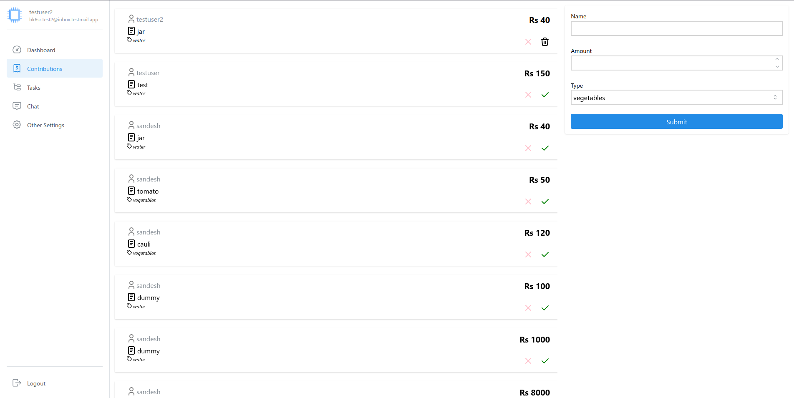
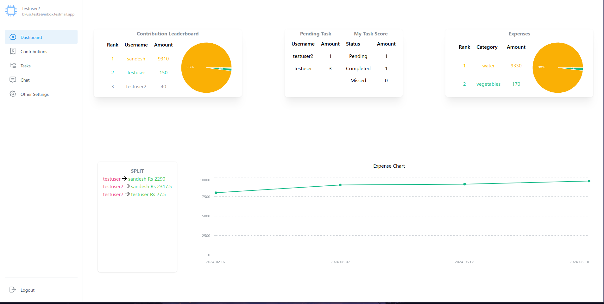
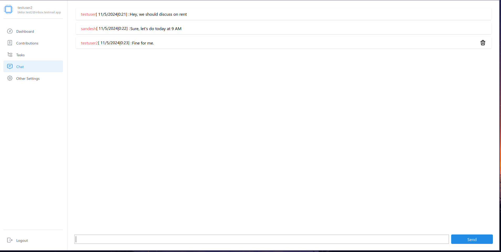

# Roommates
Roommates is a shared flat management system.

***Build With***:
1. [React](https://react.dev/)
2. [Redux](https://redux.js.org/)
3. [Socket IO](https://socket.io/)
4. [Mantine UI](https://mantine.dev/)
5. [Tailwindcss](https://tailwindcss.com/)

## Features
1. Expense Tracking

2. Splits

3. Tasking division and management

3. Chat

